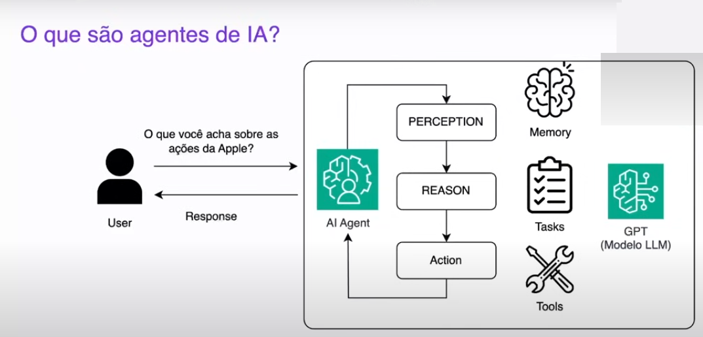
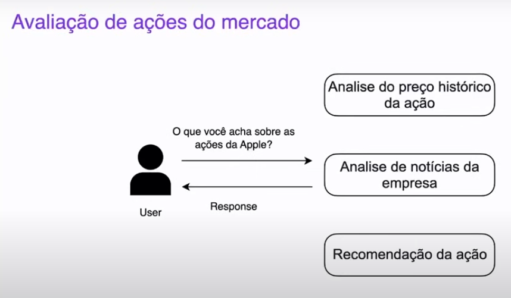

# Semana Tech IA - RocketSeat

Repositório para alocar as aulas da imersão da Rocketseat - IA na Prática - OpenAI + Python + CrewAI

## Requisitos

- [Visual Studio Code](https://code.visualstudio.com/) - Editor de código;
- [Python](https://www.python.org/downloads/) - Linguagem de programação;
- [CrewAI](https://www.crewai.com/) - Framework que fornece uma serie de métodos que permite criar um grupo de agentes de IA, também fornece as ferramentas para lidars com as tasks.

## Instalações

Atualize o pip se necessário:

```shell
python.exe -m pip install --upgrade pip
```

Crie um ambiente virtual python:

```shell
python -m venv venv
```

ou

```shell
py -m venv venv
```

Ative o ambiente virtual:

```shell
venv\Scripts\activate
```

Instale as dependências:

```shell
pip install -r requirements.txt
```

## Aula 1

Descrição do projeto: Desenvolver um consultor para o mercado de ações com a OpenAI, Python e CrewAI.

A imagem abaixo ilustra como funciona um Agente de IA, que será utilizado para as consultas. Esse agente vai ser fornecido pela CrewAI.



Funcionamento do consultor a partir da solicitação de um usuário:



Separação de cada agente:

1º Agente: Analise do preço histórico de cada ação com o Yahoo Finance, que é uma API capaz de resgatar preços de ações;

2º Agente: Analise de noticias da empresa com DuckDuck Go para pesquisar noticias sobre as empresas e ações;

3º Agente: Vai finalmente fazer a recomendação da ação usando os dados do agentes anteriores.


### Criação do arquivo `crewai-stocks.ipynb`

Esse arquivo foi criado no modelo Jupiter Notebook, por ter um formato de células, para analisar erros por partes de códigos. Mas ainda assim, no deploy o script deverá ser python.

Para executar esse arquivo algumas instalações devem ser exigidas, verifique quais são e faça-as.

Para transformar esse arquivo `.ipynb` em `.py` instale o `notebook`:

```shell
pip install notebook
```

E execute o seguinte comando do jupyter:

```shell
jupyer nbconvert --to script crewai-stocks.ipynb
```

Resultado esperado em Markdown:


### Deploy

Para efetuar o deploy da aplicação foi usado o streamlit, que fornece um método para construir uma aplicação web em python.

A criação da página web foi feita no próprio arquivo `crewai-stocks.py`.

Para executar e criar a página execute:

```shell
streamlit run crewai-stocks.py
```

Para continuar com o deploy acesse o [Streamlit Cloud](https://streamlit.io/cloud) e crie uma conta gratuita.

Em seguida crie um novo repositório no git que seja publico, conecte com o seu projeto local e envie os dados do repositório local para o remoto.

No Streamlit Cloud vá em `create app`, selecione a caixa que você tem um app no Github e configure:


Altere os campos conforme o seu **usuário** e caminhos no projeto.

Antes de fazer o deploy vá em `Advanced Settings` e configure o Python e a API KEY da OPENAI:


Salve e efetue o deploy.

Acesse o link fornecido pelo streamlit e veja a página funcionando.
